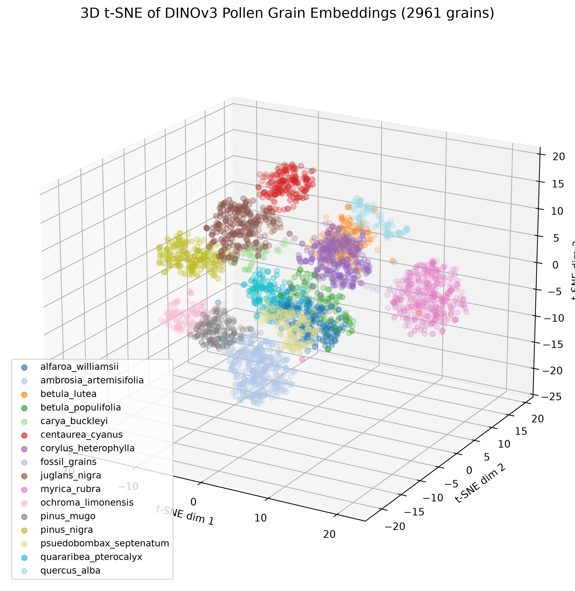

# NEST: Nearest Extant Similarity Tool

NEST is a computer vision pipeline for comparing unknown or fossil pollen grains against a curated reference set of extant pollen. Instead of treating pollen identification as a closed-set classification problem, NEST embeds each grain into a visual feature space and retrieves the most similar known grains.

The goal is practical: give paleobotany researchers a faster way to narrow down likely comparisons for fossil pollen, while preserving expert judgment as the final step.

Live demo: <https://ethanhaines.github.io>  
Project author: Ethan Haines, University of Florida



*3D t-SNE projection of DINOv3 pollen embeddings, used to inspect how grains cluster by visual similarity.*

## Why This Project Exists

This project began during a University of Florida course connected to palynology. The original idea was to explore whether computer vision could help automate pollen identification from microscope imagery.

As the project developed, the direction shifted from direct species classification to similarity search. That shift matters because fossil pollen is often an unknown query, not a guaranteed member of a known training class. For that use case, the more useful question is:

> Which known extant pollen grains are most visually similar to this unknown or fossil grain?

NEST is built around that question.

## What It Does

- Crops individual pollen grains from large microscope slide images.
- Stores crops with species and crop-size metadata.
- Embeds each crop with Meta's DINOv3 vision transformer.
- Uses FAISS/cosine similarity for nearest-neighbor search.
- Visualizes the embedding space with 2D/3D t-SNE.
- Exports static search data for a public portfolio website.
- Supports fossil-pollen query examples without requiring live model inference in the browser.

Current embedded dataset:

- `2,961` total grain embeddings
- `2,938` non-fossil/reference targets
- `23` fossil pollen query crops
- `16` displayed groups, with fossil pollen collapsed into one query group

## Technical Overview

### Image Acquisition and Curation

Images were captured with a Keyence VHX-7000 microscope at 1000x magnification. Whole-slide images are too large and noisy for direct comparison, so `crop_from_slide.py` provides an interactive cropper for manually selecting individual grains. META's Segment Anyting Model (SAM) was considered but not implemented due to inaccuracy and computational complexity.

The cropper supports:

- zooming and panning across large slide images
- variable crop sizes
- persistent markers for resuming unfinished slides
- species/crop-size folder organization

### Embeddings with DINOv3

`embed.py` uses Meta's DINOv3 model through Hugging Face Transformers. Each crop is converted to grayscale, augmented with rotations/flips, embedded in batches, L2-normalized, and stored as a NumPy matrix with JSON metadata.

This makes the comparison less dependent on stain color or orientation and more focused on shape and structural features.

### Similarity Search with FAISS

`search.py` builds a FAISS index over the stored embeddings. Because embeddings are L2-normalized, inner-product search acts like cosine similarity. The script can be used interactively to select a grain and return its closest visual matches.

For the website, `export_static_search_results.py` precomputes fossil-query leaderboards into JSON. This keeps the public demo fully static and GitHub Pages-friendly.

### Visualization

`visualize.py` projects embeddings into t-SNE space for inspection. The project supports interactive 2D/3D visualization, hover labels, and image opening.

Conceptually, DINOv3 converts each pollen crop into a high-dimensional feature vector: a point in an n-dimensional space where nearby points should represent visually similar grains. That space is not directly human-readable, so NEST uses t-SNE to reduce it into either 2D or 3D coordinates. The 2D view is useful for quick inspection, while the 3D view preserves more spatial structure and is better suited for the interactive feature-space graph on the website.

The live website renders the feature space as an interactive 3D graph. Fossil pollen nodes are highlighted with a red/black pulse, and static query results show side-by-side fossil/reference comparisons.

## Repository Structure

```text
crop_from_slide.py              Interactive cropper for full slide images
embed.py                        DINOv3 embedding generation
search.py                       Local FAISS similarity search
visualize.py                    Local t-SNE visualization
export_hypercube_package.py     Web-friendly 3D graph export
export_static_search_results.py Static fossil query leaderboard export
rename_grains.py                Renumber crops after deleting bad examples
cropped_grains/                 Curated individual pollen crops
embeddings/                     Stored embedding matrix and metadata
```

## Typical Workflow

```powershell
# 1. Crop grains from microscope slide images
python crop_from_slide.py

# 2. Generate embeddings
python embed.py cropped_grains --output embeddings/grain_embeddings.npy

# 3. Search locally with FAISS
python search.py --index embeddings/grain_embeddings.npy --k 10

# 4. Visualize locally
python visualize.py -I

```

## Status

NEST is feature-complete as a working prototype. The pipeline now supports data curation, embedding, retrieval, visualization, and static web presentation. The next meaningful improvement is not a new feature, but more data: expanding the extant reference set will make fossil comparisons more useful and scientifically defensible.

## Why It Matters

Manual pollen identification is expert-driven and time intensive. NEST does not try to replace that expertise. It is designed to reduce the search space: given an unknown grain, return visually similar extant candidates that a researcher can inspect more quickly.

That makes it a practical bridge between computer vision and paleobotanical research.

## Acknowledgments

This project was developed in collaboration with the Curator of Paleobotany at the Florida Museum of Natural History, Dr. Steven Manchester. We were also assisted by Dr. Arthur Porto, the curator of Artificial Intelligence at the Florida Museum of Natural History. Their expertise and guidance were instrumental in shaping the project's direction and ensuring its scientific relevance.
